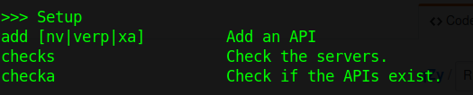
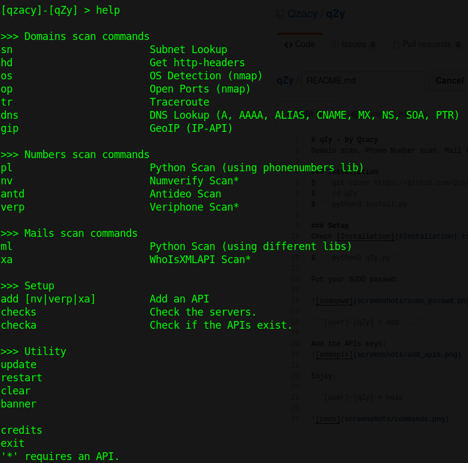

# qZy - by Qzacy
Domain scan, Phone Number scan, Mail scan.

### Installation
$ ```git clone https://github.com/Qzacy/qZy.git```
$ ```cd qZy```
$ ```python3 install.py```

### Setup
Check [Installation](#Installation) to install the requirements:

$ ```python3 qZy.py```

Put your SUDO passwd:


```[user]-[qZy] > add ...```

Add the APIs keys:



Enjoy:

```[user]-[qZy] > help```



### APIs
[WhoIsXMLAPI](whoisxmlapi.com):

Mail scan

[Numverify](numverify.com):

Phone number scan

[Veriphone](veriphone.io):

Phone number scan

[Antideo](antideo.com):

Phone number scan

+Scott Brady's Email-Verificatin-Script
[Website](https://www.scottbrady91.com)
